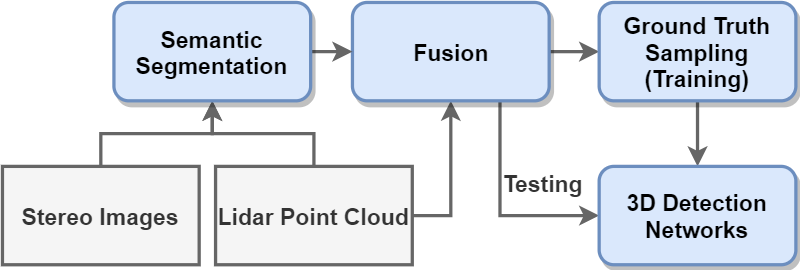
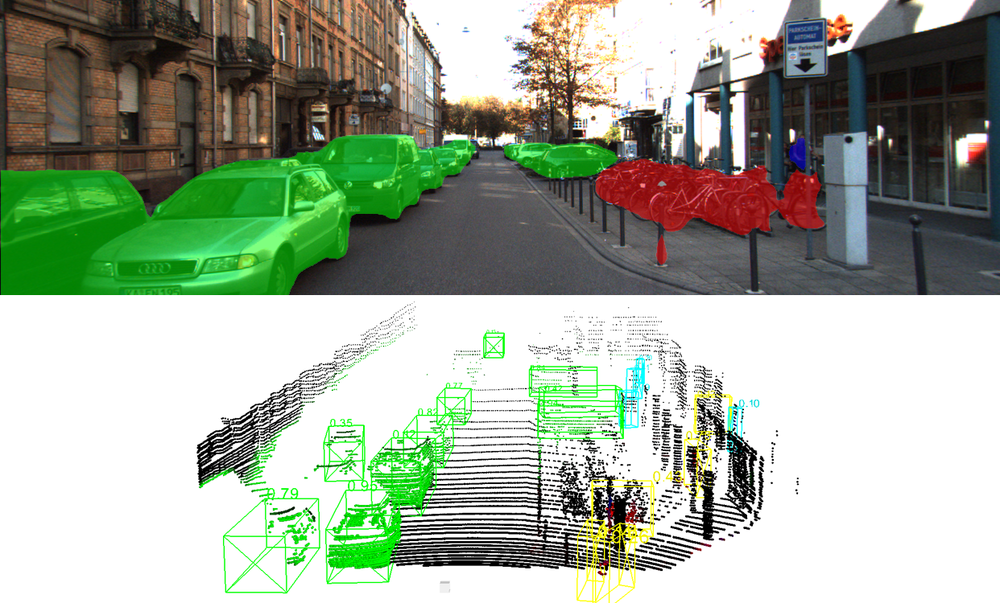
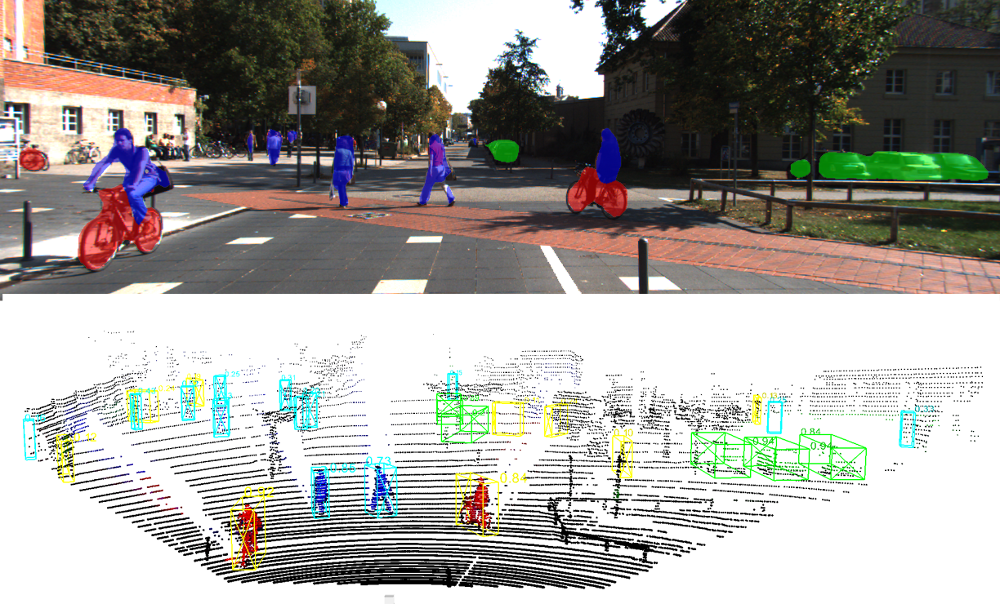

# PointPainter
## Segmentation Guidance for 3D object Detection

## Overview
This project uses segmentation information to guide the Lidar 3D detection both in training and inference. This guidance may come from stereo images, Lidar point cloud itself, or ground truth information. The model we implemented consists of four main stages:
- Semantic segmentation: an image or Lidar based semantic segmentation network which computes the pixel-wise or point-wise segmentation scores;
- Fusion: Lidar points are “painted” by projected image segmentation scores or directly Lidar segmentation scores. These segmentation scores will serve as additional feature coordinates to spatial positions of Lidar points;
- Ground truth sampling: when training, use the ground truth 3D boxes to the segment point clouds so that we could augment the training data;
- 3D object detection: a Lidar based 3D detection network to estimate oriented 3D boxes from these "painted" point clouds.

## Results

### Painted point cloud and detection results

### Evaluation results on KITTI validation set

 We calculate the AP in BEV(bird's eye view) metrics. V, P, C represents the vehicle, pedestrian, cyclist class, and e, m, h represents easy, moderate, and hard.

 ## Video

